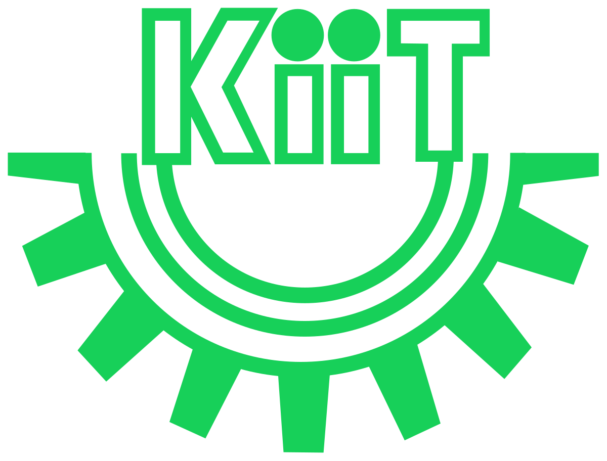

<h3 align="center">"Talk is cheap. Show me the code"</h3>
<h4 align="center">- Linus Torvalds -</h4>

 

 
 

 

## Language and Tools

#### Main Stack:
  
  
  

  

  

#### Studying in this moment:
  
  
  
 

  

#### Tools:

  
  
  
  

 

## Academic Background:

**Software Engineering Undergraduate** \
[**Kalinga Institute of Industrial Technology**](https://www.google.com/url?sa=t&rct=j&q=&esrc=s&source=web&cd=&ved=2ahUKEwiRh4_Fqv-DAxWbxjgGHYuLBmYQFnoECA8QAQ&url=https%3A%2F%2Fkiit.ac.in%2F&usg=AOvVaw3wSr3h_34TPltM8tyCohvr&opi=89978449)  • In progress\
Skills: `Agile Methodologies` `Requirements Engineering` `Software Architecture` `Professional Ethics`
`Project Management` `Software Development` `Software Security` `Software Quality`

**Full Stack Developer** \
[**Apni Kaksha**](https://www.apnacollege.in/) • In progress \
Skills: `HTML5` `CSS3` `SASS` `Flexbox` `GRID` `Bootstrap` `JavaScript` `Git` `GitHub` `TypeScript` `PostgreSQL` `NodeJs` `ExpressJS` `NextJs`
`Bulma` `MongoDB` `ElectronJS`

**GATE[Graduate Aptitude Test in Engineering ]** \
[**Physics Wallah**](https://www.pw.live/study/batches/study) • In progress \
Skills: `Operating System` `Computer Organization and Architecture` `DBMS` `Compiler Design` `AFL`  `Theory of Computation` `Algorithms` `General Aptitude`
 

## Contact me:
 

 <!-- -->

    

    

